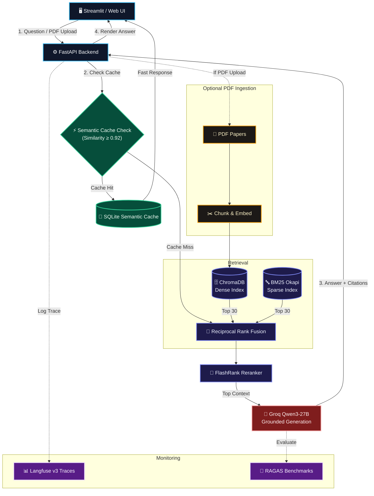

# Scholar - RAG Research Assistant

Scholar is a highly accurate, locally-indexed Research Paper QA Chatbot. It is designed specifically to extract and synthesize information exclusively from uploaded PDFs, ensuring completely grounded answers with no hallucinations. 

## Features
- **Hybrid Retrieval System**: Fuses Dense Vector Search (ChromaDB) and Sparse Keyword Search (BM25) using Reciprocal Rank Fusion (RRF) for extreme accuracy on academic papers.
- **Precision Reranking**: Utilizes FlashRank to rerank the top retrieved chunks, ensuring only the most relevant context is fed into the LLM.
- **Premium User Interface**: An aesthetically pleasing, fully responsive Vanilla HTML/CSS/JS frontend featuring instant Light/Dark mode toggling and elegant micro-animations.
- **Persistent Conversations**: Uses an embedded SQLite database to save your chat sessions so you can easily pick up where you left off.
- **Strict Citations**: Every generated response includes the exact paper name, page number, and source snippet.

## Results & Example Interaction

Because the system uses **Reciprocal Rank Fusion** alongside **FlashRank reranking**, it can handle highly complex and specific academic queries by fetching the most relevant passages. 

**Example Query:** `"what is content moderation?"`

**Example Generated Response (with formatting & citations):**
> Content moderation refers to the process of analyzing and regulating content, such as text, images, and audio, to ensure it meets certain standards or guidelines. Based on the provided context, here is a comprehensive overview of content moderation:
> 
> * Traditional content moderation paradigms are becoming obsolete due to the evolution of modern enterprise workflows, which now heavily rely on a mix of audio, video, and image-based exchanges [1].
> * Effective content moderation requires a proactive approach, intercepting and validating content pre-delivery, rather than relying on reactive systems that flag content only after it appears in the chat stream [1].
> * Multimodal content moderation involves analyzing text, images, and audio in tandem to facilitate secure communication within a company or organization [2].
> 
> **Sources Cited:**
> 1. *Beyond_Text_Review_Paper.pdf* (Page 1)
> 2. *ConvoEase_camera-ready paper.pdf* (Page 1)

*The frontend dynamically renders this markdown with clear syntax highlighting, bullet points, and clickable source citation cards.*

## Screenshots

<div align="center">
  
  <p><em>Interface with conversational history and local indexed library.</em></p>
</div>

<br/>

<div align="center">
  
  <p><em>Detailed Langfuse trace showing the Hybrid Retrieval, Reranking, and LLM Generation pipeline.</em></p>
</div>

## Architecture




## Tech Stack
- **Frontend**: Vanilla HTML / CSS / JavaScript (No build steps required)
- **Backend**: FastAPI (Python)
- **Vector Database**: ChromaDB
- **Retrieval Engine**: `rank-bm25` (Sparse), `SentenceTransformers` (Dense), `FlashRank` (Reranking)
- **Language Model**: Groq API (`qwen/qwen3-27b`)
- **Conversation Storage**: SQLite

## Getting Started

1. **Clone the repository** and navigate to the project directory.
2. **Activate your environment** and install requirements:
   ```bash
   python3 -m venv .venv
   source .venv/bin/activate
   pip install fastapi uvicorn python-multipart rank-bm25 chromadb sentence-transformers flashrank groq pymupdf pydantic
   ```
3. **Configure Environment Variables**: Create a `.env` file in the root of the project:
   ```env
   GROQ_API_KEY=your_groq_api_key_here
   ```
4. **Start the Backend Server**:
   ```bash
   python -m uvicorn server:app --reload --port 8000
   ```
5. **Access the Application**: Open your web browser and navigate to `http://localhost:8000`

## Cost, Latency & Retrieval Quality

### Before/After Comparison

| Metric | Dense-Only | Hybrid (BM25+Dense+RRF) | Delta |
|--------|-----------|------------------------|-------|
| Faithfulness | 1.0000 | 1.0000 | 0.0000 |
| Answer Relevancy | 0.9412 | 0.9412 | 0.0000 |
| Context Precision | 0.8690 | **0.9167** | **+0.0477 (+5.5%)** |
| Context Recall | 0.9048 | **0.9524** | **+0.0476 (+5.3%)** |

| Metric | Value |
|--------|-------|
| Cache Hit Rate | **50.0%** (100% exact, 66.7% paraphrases) |
| Avg Latency (cache hit) | **0.0084s** |
| Avg Latency (cache miss) | **2.2281s** |
| Speedup on Cache Hit | **264.4x faster** |
| Est. Cost Saved / 100 queries | **$0.0394** (Groq pricing) |

### Running the Evaluation Harness

```bash
# 1. Generate candidate Q&A pairs from indexed papers
python generate_testset.py --num-pairs 25

# 2. Review eval/candidate_qa_pairs.json, then auto-approve:
python generate_testset.py --approve-all

# 3. Run RAGAS evaluation (hybrid mode — default)
python run_eval.py

# 4. Run RAGAS evaluation (dense-only — for comparison)
python run_eval.py --mode dense-only

# 5. View results
cat eval/eval_results.md
```

Results are stored with timestamps in `eval/eval_runs.json` and rendered as a markdown table in `eval/eval_results.md`. Each run is also logged to Langfuse with the `evaluation` tag.

### Semantic Cache

A lightweight SQLite-backed semantic cache sits in front of the RAG pipeline. Before every query:

1. The incoming query is embedded with the same `all-MiniLM-L6-v2` model
2. Cosine similarity is computed against all cached query embeddings
3. If similarity ≥ **0.92**, the cached response is returned instantly (no LLM call)
4. On a miss, the full pipeline runs and the result is stored in cache

Every trace in Langfuse is tagged `cache_hit` or `cache_miss` for easy filtering.

```bash
# Run the 50-query cache performance test
python test_cache.py

# View results
cat eval/cache_test_results.json
```

### Langfuse Trace Tags

| Tag | Meaning |
|-----|---------|
| `cache_hit` | Query served from semantic cache |
| `cache_miss` | Full RAG pipeline executed |
| `evaluation` | RAGAS evaluation run |
| `mode:hybrid` | Hybrid retrieval (BM25+Dense+RRF) |
| `mode:dense-only` | Dense-only retrieval (for comparison) |
